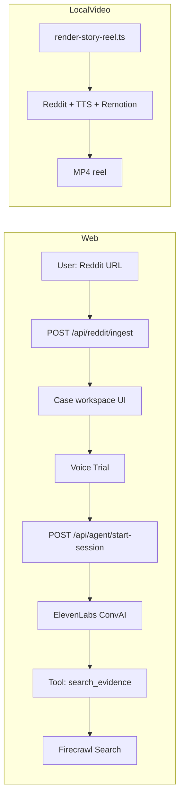

# AITAH?! — The Verdict Bot

Turn a Reddit **Am I the Asshole?** post into a **web trial** (text + voice), optional **Firecrawl “receipts”**, and a **short vertical video** (~60–90s) built with **Remotion** and **ElevenLabs** narration.

---

## What it does

1. **Web app** — Paste a valid Reddit post URL. The backend loads the thread via Reddit’s public `.json` API, analyzes top comments (NTA/YTA/ESH, etc.), generates a scripted **debate**, fetches **search snippets** via Firecrawl, and shows a **verdict** card.
2. **Voice trial** — An **ElevenLabs Conversational AI** agent (“Judge Verdict”) gets **case context** patched per session. It can call a **server tool** that runs **Firecrawl search** and returns evidence text.
3. **Video export** — A local script fetches the same data, generates **TTS with timestamps**, and **Remotion** renders a reel (gameplay-style background, line-by-line post, Reddit Trial overlays, verdict). Intended to stay **under ~90s** for hackathon-style submissions.

---

## Tech stack

| Area | Stack |
|------|--------|
| UI | Vite, React, TypeScript, Tailwind, Framer Motion, shadcn-style components |
| Local API | Express — `server/index.ts` (default port **3001**) |
| Hosted API + static site | Vercel — `api/*` serverless functions + Vite build (`vercel.json`) |
| Voice agent | ElevenLabs ConvAI + `@elevenlabs/react` |
| TTS (video pipeline) | ElevenLabs API (see `scripts/render-story-reel.ts`) |
| Search | Firecrawl Search API |
| Video | Remotion (`remotion/`) |

---

## Repository map

| Path | Role |
|------|------|
| `src/pages/Index.tsx` | Landing: URL validation, samples, triggers ingest |
| `src/components/CaseWorkspace.tsx` | Tabs: Voice Trial, text trial, post, comments, receipts, verdict |
| `src/components/VoiceTrial.tsx` | Live conversation UI; calls `POST /api/agent/start-session` |
| `src/components/DiscussionChat.tsx` | Animated text “trial” from generated debate messages |
| `server/index.ts` | Ingest, debate, verdict, reel render spawn, agent + Firecrawl webhook routes |
| `api/_lib/reddit.ts` | Shared Reddit parse / jury / debate helpers for Vercel |
| `api/reddit/ingest.ts` | Vercel: same ingest as Express (Reddit may **403** from datacenter IPs) |
| `api/agent/start-session.ts` | Vercel: patch agent + signed URL; prefers **`caseBundle`** body |
| `api/agent/tools/search-evidence.ts` | Vercel: ElevenLabs tool webhook → Firecrawl |
| `remotion/` | Compositions (`RedditStoryReel.tsx`), overlays, `Root.tsx` defaults |
| `scripts/render-story-reel.ts` | End-to-end story reel: fetch → TTS → Remotion → MP4 |
| `scripts/setup-agent.ts` | Optional: baseline ElevenLabs agent config + webhook URL reminder |

---

## Prerequisites

- **Node.js** 18+ (LTS recommended)
- **npm**
- API keys (see below). Never commit real keys; use `.env` locally and Vercel env for production.

---

## Environment variables

Create a **`.env`** in the repo root (see `.gitignore`; it is not committed).

| Variable | Used for |
|----------|-----------|
| `ELEVENLABS_API_KEY` | TTS, ConvAI agent API, signed URLs |
| `ELEVENLABS_AGENT_ID` | ConvAI agent id for voice trial |
| `FIRECRAWL_API_KEY` | Receipts on ingest + `search_evidence` tool |
| `ELEVENLABS_MALE_VOICE_ID` / `ELEVENLABS_FEMALE_VOICE_ID` (or `ELEVENLABS_NARRATOR_VOICE_ID`) | Video narration voice selection in render script |

Optional: run `npx tsx scripts/setup-agent.ts https://your-deployment.vercel.app` after deploying so printed instructions match your webhook URL. Configure the **`search_evidence`** server tool in the ElevenLabs dashboard to point at:

`https://<your-domain>/api/agent/tools/search-evidence`

Enable **conversation overrides** for dynamic prompt / first message if the dashboard requires it.

---

## Install

```sh
git clone <repo-url>
cd the-verdict-bot
npm install
# If peer dependency errors appear:
# npm install --legacy-peer-deps
```

Copy `.env` from a teammate or create one using the table above.

---

## How to run locally (recommended for full features)

Vite proxies **`/api`** to the Express server (`vite.config.ts`).

```sh
npm run dev:all
```

- **Frontend:** http://localhost:8080 (or the port Vite prints)
- **API:** http://localhost:3001

**Alternative (two terminals):**

```sh
npm run server   # API on 3001
npm run dev      # Vite (proxies /api → 3001)
```

### What to test in the browser

1. Open the app URL.
2. Paste a **reddit.com** post URL in the form  
   `https://www.reddit.com/r/<subreddit>/comments/<id>/...`
3. Submit — you should see **post**, **comments**, **debate** tab, **receipts** (if Firecrawl is configured), **verdict**.
4. Open **Voice Trial** — allow microphone — **Start Voice Trial**. The backend patches the agent and returns a signed session URL.
5. Use **Text Trial** to watch the scripted chat without voice.

### Quick API checks (optional)

```sh
# Ingest (replace URL)
curl -s -X POST http://localhost:3001/api/reddit/ingest \
  -H "Content-Type: application/json" \
  -d "{\"url\":\"https://www.reddit.com/r/AmItheAsshole/comments/13xga9y/aita_for_uninviting_my_sister_to_my_wedding/\"}"
```

Voice session (local; uses Reddit fetch on server):

```sh
curl -s -X POST http://localhost:3001/api/agent/start-session \
  -H "Content-Type: application/json" \
  -d "{\"url\":\"https://www.reddit.com/r/AmItheAsshole/comments/13xga9y/aita_for_uninviting_my_sister_to_my_wedding/\"}"
```

---

## Deployed demo (Vercel)

Production builds use **`api/*`** for serverless routes. **Reddit often returns 403** when called from cloud IPs; the **Voice Trial** flow sends **`caseBundle`** from the client after a successful ingest so the agent can start without the server re-fetching Reddit.

Set the same env vars on the Vercel project. After changing env vars, **redeploy** so functions pick up configuration as expected.

---

## Render the story video (local)

Requires **FFmpeg** on PATH (Remotion uses it). Reddit + ElevenLabs must work from your machine.

```sh
# Optional: pass Reddit URL as first argument; otherwise a default sample URL is used
npx tsx scripts/render-story-reel.ts "https://www.reddit.com/r/AmItheAsshole/comments/..."
```

Or:

```sh
npm run render:story -- "https://www.reddit.com/r/AmItheAsshole/comments/..."
```

Default output file: **`aitah-story-reel-60s.mp4`** in the project root (see console log at end of run). Background video is expected at `public/video/parkour-bg.mp4` if you use the parkour asset (add locally; large files are gitignored).

**Remotion preview** (no full render):

```sh
npm run remotion:preview
```

**Note:** `POST /api/reels/render` on the Express server spawns the render script locally; this is **not** suitable for Vercel serverless.

---

## Other scripts

| Command | Purpose |
|---------|---------|
| `npm run build` | Production Vite build → `dist/` |
| `npm run lint` | ESLint |
| `npm test` | Vitest |

---

## End-to-end flow (mental model)



1. **Ingest** loads and shapes data for the UI.  
2. **Voice trial** reuses that data (on Vercel) or refetches by URL (local).  
3. **Video** is a separate pipeline that does its own fetch + audio + render.

---

## Security notes

- Reddit URL validation on client and server; rate limiting on `/api/*` (Express).
- Keep API keys in env only; rotate if exposed.

---

## License / attribution

Built for a hackathon-style demo integrating **ElevenLabs** and **Firecrawl**. Original scaffolding may include Lovable-generated pieces; this README describes the current **Verdict Bot** architecture and workflows.
